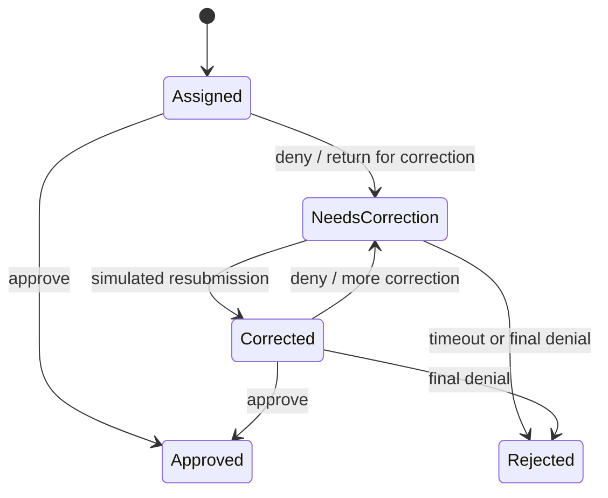

# Mock COLA Integration

**Status:** Local-decision contract; seeded search superseded  
**Last updated:** 2026-08-09  
**Depends on:** [Requirements](./requirements.md) and [Implementation plan](./implementation-plan.md)

## 1. Purpose

> Update: searchable seeded records have been replaced by the generated, read-only public metadata index described in [Public COLA Metadata Index](./public-cola-index.md). This document remains authoritative only for the isolated local-decision HTTP contract and lifecycle simulation.

Simulate the COLAs Online functions needed by the prototype:

1. Search eligible applications using facts inferred from enforcement photos.
2. Retrieve the matched application's facts and approved-label metadata.
3. Receive a simulated agent **Approve** or **Deny** decision.

The simulator exercises a real internal HTTP boundary but is visibly and technically separate from TTB. It receives structured search clues, never uploaded photos.

## 2. What the official interface tells us

Official industry-facing material exposes these useful concepts:

- Application lists include identifiers, brand/fanciful names, serial number, status, status date, and action deadlines.
- Application Detail includes TTB ID, status, product/source/application type, permit and applicant information, brand/fanciful name, net contents, alcohol content, special wording, and separate label images with panel type and physical dimensions.
- Observable statuses include **Received**, **Assigned**, **Needs Correction**, **Corrected**, **Conditionally Approved**, **Approved**, **Rejected**, **Withdrawn**, **Surrendered**, **Revoked**, and **Expired**.
- **Approved** and **Rejected** are final review actions. Electronic applications are generally placed in **Needs Correction** first, with reasons and a response period.
- **Conditionally Approved** supports proposed changes to a limited set of fields and requires applicant acceptance or decline.

Sources: [COLAs Online FAQs](https://www.ttb.gov/faqs/colas-and-formulas-online-faqs), [Application Detail manual](https://www.ttb.gov/system/files/images/pdfs/labeling/application-detail.pdf), [Correct Application manual](https://www.ttb.gov/system/files/images/pdfs/labeling_colas-docs/correct-application.pdf), and [conditional approval guidance](https://www.ttb.gov/public-information/news/new-conditionally-approved-status-in-colas-online).

The public material documents the industry-member interface, not an internal specialist search/write API. This mock preserves observable fields and lifecycle semantics; it does not claim protocol or visual compatibility.

## 3. Scope

### Implement now

- Searchable, seeded distilled-spirits applications.
- Structured application facts, normalized search aliases, approved panels, and dimensions.
- Ranked candidate search with explainable matching signals.
- Approval and denial over internal HTTP.
- Correction reasons, notes, status transitions, idempotency, and receipts.
- In-memory state reset on service restart.

### Defer

- Real TTB credentials, endpoints, SSO, accounts, or permissions.
- Applicant correction/resubmission and conditional-approval workflows.
- Email, timers, certificates, surrender, revocation, and registry publication.
- Exact reproduction of the COLAs Online UI.

## 4. Components and boundary

### `cola-mock`

A separate FastAPI process on the private Compose network. It owns the searchable fixtures, current revisions/statuses, allowed transitions, and decision receipts. It has no public-internet route.

### Main API `ColaGateway`

The product API sends normalized `ColaSearchQuery` values to the mock, loads the selected application, and submits decisions. Raw photos, image URLs, and OCR-provider details never cross this boundary. A future authorized integration can replace the adapter without changing domain logic.

### Web UI

The browser calls only the product API. It cannot contact `cola-mock` directly or configure an integration URL.

## 5. Mock domain model

| Model | Required fields |
| --- | --- |
| `ColaApplication` | Mock TTB ID, revision, status/dates, serial, product/source/application type, permit/applicant, application facts, approved panels. |
| `ColaSearchDocument` | Application ID plus normalized identifiers, brand/fanciful aliases, class/type, ABV, net contents, responsible party/address, origin, and eligible status. |
| `ColaSearchQuery` | Structured clues with normalized value, clue type, confidence, and product-API evidence reference. |
| `ColaMatchCandidate` | Application summary, total score, rank, supporting/conflicting signals, and distinguishing fields. |
| `ColaDecision` | Verification ID, application revision, approve/deny, disposition, reasons, notes, override explanation, and idempotency key. |
| `ColaDecisionReceipt` | Receipt ID, mock marker, prior/new status, decision, actor label, timestamp, revision, verification/ruleset reference. |
| `CorrectionReason` | Stable code, field/check ID, readable reason, and optional details. |

The mock does not store OCR text, enforcement photos, raw applicant contacts beyond fixture data, or full verification evidence.

## 6. Identification contract

### Signals

Candidate scoring uses explicit, testable signals. Initial relative priority is:

1. Exact visible identifiers such as TTB ID, serial number, or permit number.
2. Brand and fanciful-name agreement.
3. Class/type, ABV, and net contents agreement.
4. Responsible party, address, source/import status, and country of origin.

Contradictions reduce the score. A fuzzy match on one low-information field cannot identify an application. Scoring configuration and normalization version are returned for traceability.

### Outcomes

- **Matched:** top candidate exceeds the automatic-link threshold and its score exceeds the runner-up by the configured margin.
- **Needs identification:** one to three credible candidates exist, but the threshold or margin is not met.
- **No match:** no eligible record meets the candidate floor.

The product API owns these thresholds and the final link decision. The mock only returns ranked evidence. Agent selection is permitted only among candidates returned for the current short-lived verification.

### Applicability

After a match is confirmed, the product API uses category, source/import status, application type, facts, and available observations to build the cross-reference plan. The mock supplies data; it does not run compliance rules or decide which checks pass.

## 7. Seed scenarios

Ship deterministic fixtures that exercise both identification and disposition:

1. Unique clean application expected to identify and pass.
2. Same brand across different class/type, ABV, or net-content variants.
3. Near-identical brand/fanciful names that require distinguishing evidence.
4. Ambiguous photos that return two candidates.
5. No matching application.
6. Assigned application with a government-warning mismatch.
7. Corrected application with a mismatch and eligible final rejection.
8. Imported application with a country-of-origin discrepancy.

Include expected ranking signals, applicability plan, verification outcomes, and permitted decisions. Use synthetic assets or reviewed public examples with recorded provenance.

## 8. HTTP contracts

### Product API

| Method and path | Purpose |
| --- | --- |
| `POST /api/v1/enforcement-items/verifications` | Accept repeated photo parts only; OCR, search, and verify if confidently matched. |
| `POST /api/v1/verifications/{verification_id}/application-match` | Confirm a returned candidate and verify without rerunning OCR. |
| `POST /api/v1/verifications/{verification_id}/decisions` | Validate and send an agent decision for the confirmed application. |

Read-only application-list/detail routes may exist in a development inspector, but they are not the main user journey.

### Internal mock API

| Method and path | Purpose |
| --- | --- |
| `POST /mock/v1/applications/search` | Return at most three eligible candidates for structured clues. |
| `GET /mock/v1/applications/{application_id}` | Return current revision, facts, and trusted approved-panel references. |
| `GET /mock/v1/applications/{application_id}/panels/{panel_id}` | Stream a seeded approved panel to the product API when comparison requires it. |
| `POST /mock/v1/applications/{application_id}/decisions` | Enforce transition/idempotency rules and return a receipt. |
| `POST /mock/v1/testing/reset` | Reset fixtures in automated-test mode only; absent otherwise. |

### Search request

```json
{
  "normalization_version": "identification.v1",
  "clues": [
    {"type": "brand_name", "value": "north star", "confidence": 0.98, "evidence_ref": "img_1:span_4"},
    {"type": "abv", "value": "40", "confidence": 0.96, "evidence_ref": "img_2:span_8"},
    {"type": "net_contents_ml", "value": "750", "confidence": 0.94, "evidence_ref": "img_2:span_12"}
  ],
  "eligible_statuses": ["assigned", "corrected"],
  "limit": 3
}
```

### Search response

```json
{
  "mock": true,
  "scoring_version": "cola-search.v1",
  "candidates": [
    {
      "application_id": "mock_ttb_24001001000001",
      "revision": 1,
      "score": 0.96,
      "supporting_signals": ["brand_name", "abv", "net_contents_ml"],
      "conflicting_signals": [],
      "distinguishing_fields": {"class_type": "Bourbon Whisky", "net_contents": "750 mL"}
    }
  ]
}
```

### Decision request

```json
{
  "verification_id": "ver_01...",
  "decision": "deny",
  "disposition": "needs_correction",
  "reason_codes": ["government_warning.text"],
  "notes": "Use the exact required warning statement.",
  "override_explanation": null,
  "expected_status": "assigned",
  "expected_revision": 1,
  "idempotency_key": "dec_01..."
}
```

Approval omits `disposition`; denial uses `needs_correction` or eligible `rejected`.

### Decision response

```json
{
  "mock": true,
  "receipt_id": "mock_receipt_01...",
  "application_id": "mock_ttb_24001001000001",
  "decision": "deny",
  "prior_status": "assigned",
  "new_status": "needs_correction",
  "revision": 2,
  "decided_at": "2026-08-06T20:00:00Z"
}
```

The product API preserves `mock: true`.

## 9. State and decision rules



- Default denial is **Needs Correction**.
- Final **Rejected** is limited to a corrected or seeded eligible scenario and requires stronger confirmation.
- Decisions require a confirmed match, completed or partial verification, current application revision, and eligible status.
- Approval with **Mismatch** or **Needs review** requires an override explanation.
- Denial requires a reason; denial when all checks pass also requires an override explanation.
- Repeating an idempotency key returns the original receipt. A conflicting or stale decision returns `409`.
- Automated results inform but never make the decision.

Conditional approval remains deferred because it is an applicant accept/decline workflow, not a synonym for agent approval.

## 10. UI behavior

### Photo intake

- Start with **Add enforcement photos** and one **Verify label** action.
- Do not show an application form, panel-role controls, or an application queue.
- Show thumbnails with accessible remove actions and allow additional photos.
- Persistently display **Mock COLA — Simulation; no government system connected**.

### Identification

- For an automatic match, show mock TTB ID, record facts, confidence, supporting photo text, and any conflicts before findings.
- For ambiguity, show at most three candidates with distinguishing fields, a selection action, and an option to add clearer photos.
- For no match, identify useful missing evidence. Do not expose approve/deny.
- Candidate selection must be keyboard and screen-reader operable and must not require inspecting image overlays.

### Results and decision

- Show applicable/skipped cross-references with reasons and evidence-linked results.
- Keep **Approve** and **Deny** visually separate from automated findings and disabled until the record is confirmed.
- Deny defaults to **Needs Correction** with result-derived reasons.
- Confirmation names the mock application and resulting status.
- On success show receipt and new status; on error preserve work and retry with the same idempotency key.

Status uses text/icon/color, not color alone. Dialogs follow accessible focus, keyboard, cancellation, and restoration behavior.

## 11. Timing and failure behavior

Application search is part of the five-second verification budget and should normally complete within 200 ms in the seeded service. Decision acknowledgement targets one second with a two-second client timeout.

| Failure | Product behavior |
| --- | --- |
| Search unavailable/timeout | Return identification unavailable; no match or decision is inferred. |
| Ambiguous candidates | Return **Needs identification** with candidates and distinguishing evidence. |
| No candidate | Return **No match** and photo guidance. |
| Aggregate image work exceeds safe envelope | Reject before OCR or return an explicitly partial result; explain the limit. |
| Mock unavailable during decision | No status change; retain the idempotency key and offer retry. |
| Stale revision/status | `409`; refresh details and require review. |
| Invalid transition | `409`; explain allowed next actions. |
| Invalid reasons/notes | `422` with field-level errors. |
| Duplicate idempotency key | Return the original receipt. |

## 12. Security boundary

- Bind `cola-mock` only to the private Compose network; expose it to the host only in an explicit development profile.
- Allowlist its internal base URL in trusted configuration.
- Accept only typed, length-limited structured clues; never raw images, remote URLs, or executable query syntax.
- Use synthetic IDs and a prominent mock marker in UI, API, logs, and receipts.
- Never use real TTB credentials, cookies, production endpoints, or branding that implies authorization.
- Cap responses and panel downloads; validate even trusted fixture images.
- Log IDs, scores, decisions, and timings—not label content, OCR text, or applicant PII.
- Make reset and failure-injection controls unavailable outside automated-test mode.

## 13. Tests and acceptance

Unit tests cover:

- normalized indexing and scoring signals;
- exact, near, conflicting, ambiguous, and absent matches;
- candidate ordering and deterministic ties;
- transition matrix, decision validation, idempotency, and stale revisions.

Integration tests cover:

- photos-derived structured clues through product API to mock search;
- candidate detail/panel retrieval and applicability planning;
- approve to **Approved**, deny to **Needs Correction**, and eligible **Rejected**;
- search/decision timeout, malformed response, `409`, duplicate receipt, and reset behavior.

End-to-end tests cover:

- photos only → automatic match → verification → mock decision;
- ambiguous match → candidate confirmation → verification without rerunning OCR;
- no match → add a clearer photo → match;
- known mismatch → prefilled correction reason → denial receipt;
- override, cancellation, retry, keyboard-only, and axe paths.

The integration is complete when US-02 through US-04 and US-09 are traceable to tests, the UI requires no record selection or data entry on the happy path, and a network trace shows structured search plus a decision sent to the separate mock service.
