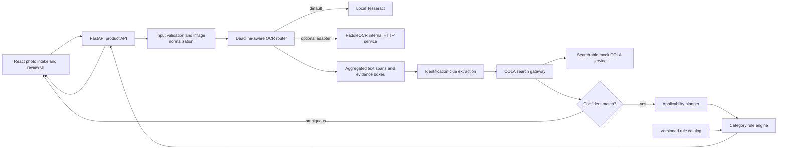
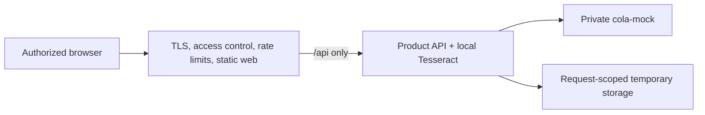

# Alcohol Label Verification — Implementation Plan

**Status:** Implementation baseline selected; deployment authorization pending  
**Last updated:** 2026-08-09  
**Depends on:** [Requirements](./requirements.md)  
**Companion plan:** [OCR Optimization Plan](./ocr-optimization-plan.md)

## 1. Implementation outcome

Deliver a single-case distilled-spirits verifier that:

- accepts only an enforcement item's photos on the normal path;
- identifies the most likely record in a locked snapshot of public COLA metadata and exposes ambiguity;
- derives the applicable cross-reference plan from the matched record;
- returns evidence-backed **Pass**, **Mismatch**, or **Needs review** results;
- records approval/denial as isolated local review state;
- finishes within five seconds after upload under documented test conditions;
- uses local OCR by default and supports additional OCR adapters behind one contract;
- can be released as an anonymous synthetic-only prototype after explicit deployment authorization;
- remains easy to extend with category-specific rules.

Verification is synchronous. The generated SQLite metadata index is immutable; local decision receipts and verification references remain ephemeral. The prototype does not need a durable application database, job queue, microservice fleet, or direct COLAs Online integration. The reproducible ingestion and build contract is defined in [Public COLA Metadata Index](./public-cola-index.md), which supersedes the earlier seeded-record plan.

## 2. Architecture and stack

### Recommended stack

| Area | Choice | Why |
| --- | --- | --- |
| Web UI | React + TypeScript + Vite | Typed, component-based UI with a small build surface. Vite provides an official React/TypeScript path and fast development builds. |
| API and orchestration | Python 3.12 + FastAPI + Pydantic | Python fits OCR/image libraries; FastAPI provides typed validation, multipart uploads, generated OpenAPI, and straightforward pytest integration. |
| Image handling | Pillow + OpenCV | Safe decoding/metadata inspection plus targeted deskewing, thresholding, contrast, and geometry operations. |
| Default OCR | Tesseract CLI | Mature, fully local, and requires no OCR network access. TSV output supplies text, confidence, and evidence boxes. |
| Optional OCR adapter | PaddleOCR over internal HTTP | Preserves a self-hostable network strategy for later access or accuracy needs; it is disabled by default. |
| COLA metadata | Generated read-only SQLite index behind a private FastAPI sidecar | Uses real public Registry metadata without a runtime TTB dependency; local decision state remains isolated and ephemeral. |
| Testing | pytest, Vitest + Testing Library, Playwright + axe | Unit, API integration, browser workflow, and automated accessibility coverage with common tools. |
| Packaging | OCI images + Docker Compose + Cloud Run manifest | Reproduces local development and promotes the same API/mock images to the selected managed target. |

References: [FastAPI file uploads](https://fastapi.tiangolo.com/tutorial/request-files/), [FastAPI testing](https://fastapi.tiangolo.com/tutorial/testing/), [Vite React/TypeScript support](https://vite.dev/guide/), [PaddleOCR self-hosted serving](https://www.paddleocr.ai/main/en/version3.x/inference_deployment/serving/serving.html), and [Tesseract TSV output](https://tesseract-ocr.github.io/tessdoc/Command-Line-Usage.html).

### Why this shape

- React is justified by the evidence-linked results view; server-rendered forms alone would make panel overlays and synchronized result selection harder to maintain.
- Python keeps OCR, image processing, and rule evaluation in one process.
- OCR providers implement one normalized contract. An ordered strategy policy is injected at startup, so enabling or reprioritizing an adapter does not affect extraction, matching, rules, or API schemas.
- Automated tests and explicitly selected UI fixtures use a deterministic OCR fake. Normal local use and releases default to local Tesseract, the first real provider.
- The API is synchronous because the requirement is a sub-five-second result, not a background job.
- No mutable application database or queue is required. SQLite is a generated deployment artifact, not a system of record.
- The one additional service is intentional: it owns public-metadata lookup and isolated local decisions behind `ColaGateway`.

### Parallel delivery model

Proceed on two independently testable workstreams after freezing the OCR contract:

| Workstream | Scope | Primary artifacts | Can complete without |
| --- | --- | --- | --- |
| **A — Application** | Photo intake, orchestration, identification, COLA matching, applicability, rules, results, decisions, and accessibility | `apps/api` orchestration/domain, `apps/web`, `apps/cola-mock`, rules, deterministic fake, and application journey fixtures | A tuned or trained OCR engine |
| **B — OCR optimization** | Local preprocessing, Tesseract configuration, optional provider experiments, corpus curation, accuracy analysis, and compute-budget validation | Real OCR/preprocessing adapters, OCR corpus manifest, benchmark harness/results, metrics report, and recommended runtime configuration | Product UI, decision workflow, or compliance-rule implementation |

The shared artifacts are the `OcrProvider` contract, normalized schemas, conformance suite, and a small set of integration fixtures; contract changes require review from both workstreams. Neither workstream may bypass the boundary. Workstream A consumes committed normalized OCR fixtures and must not encode Tesseract-specific behavior. Workstream B produces the same normalized outcomes and must not depend on COLA matching or compliance rules to measure OCR quality. The detailed data, experimentation, training, and benchmarking method belongs in the [OCR Optimization Plan](./ocr-optimization-plan.md), not here.

Critical dependencies are deliberately narrow:

- both workstreams require the normalized OCR contract and representative image-handling limits;
- Workstream A additionally requires stable mock COLA records and expected normalized spans;
- Workstream B additionally requires a versioned ground-truth corpus, target hardware profile, and field-oriented OCR metrics;
- final application accuracy and latency claims require integration of the selected local OCR configuration, even though most application delivery does not.

### Runtime flow



## 3. Code organization

Use one repository with independently testable web and API applications:

```text
apps/
  api/
    src/label_verifier/
      api/             # HTTP schemas, routes, error mapping
      application/     # identification, planning, verification, deadlines
      domain/          # models, matching, normalization, checks, rules
      adapters/        # independent OCR providers, COLA, rules, image decoder
      config/          # typed settings and provider composition root
    tests/
      unit/
      integration/
      fixtures/
  cola-mock/
    src/              # seeded applications, transitions, mock HTTP routes
    tests/
  web/
    src/
      api/             # generated or hand-maintained typed API client
      components/      # reusable accessible controls
      features/verify/ # photo intake, match review, results, evidence
    tests/
docs/
  requirements.md
  implementation-plan.md
  ocr-optimization-plan.md
  cola-mock-integration.md
  adr/
rules/
  distilled-spirits.v1.yaml
tools/
  corpus/              # read-only import/curation utilities
```

Dependencies point inward: adapters and HTTP routes may depend on application/domain code; domain code must not import FastAPI, OCR libraries, or filesystem/network clients.

## 4. Domain model

Implement plain Pydantic models or immutable dataclasses; do not create ORM entities.

| Model | Responsibility |
| --- | --- |
| `EnforcementItem` | One case and its unordered observation images; no user-entered application facts. |
| `ApplicationFacts` | Expected brand, class/type, ABV, net contents, responsible name/address, import status, and conditional country of origin. |
| `ObservationImage` | Validated media metadata, inferred view role, perceptual hash, and transient bytes reference. |
| `TextSpan` | OCR text, confidence, image ID, normalized bounding box, and line/block ordering. |
| `OcrOutcome` | Provider-neutral spans, success/partial/failure status, warnings, and timing; no provider-specific payload. |
| `FactCandidate` | Candidate field value, normalized value, confidence, and supporting spans. |
| `IdentificationClues` | Aggregated identifiers and fact candidates used to search for an application. |
| `ColaMatchCandidate` | Application summary, match score, supporting/conflicting signals, and rank. |
| `ApplicationMatch` | Confirmed or automatically linked application, confidence, method, and evidence. |
| `CrossReferencePlan` | Ordered applicable, skipped, and indeterminate checks with reasons. |
| `RuleSet` | Category, semantic version, source citations, retrieval date, and ordered rules. |
| `Rule` | Pure evaluation contract from facts/evidence to one `CheckResult`. |
| `CheckResult` | Check ID, status, expected/observed values, explanation, rule references, and evidence. |
| `VerificationResult` | Overall status, per-check results, ruleset version, OCR strategy trace, warnings, and stage timings. |
| `ProcessingDeadline` | Monotonic overall deadline and remaining stage budget. |
| `ColaApplication` | Mock external ID/revision/status, searchable facts/aliases, and approved panel metadata. |
| `ColaDecision` | Approve/deny intent, disposition, reasons, notes, override, expected revision, and idempotency key. |
| `ColaDecisionReceipt` | Mock marker, prior/new status, receipt ID, decision timestamp, and verification reference. |

Use enums for category, inferred view role, match status, check status, processing status, and provider outcome. Reserve `wine` and `malt_beverage` category values now, but reject them as unsupported until their rule sets exist.

### Comparison rules

- Normalize Unicode, case, repeated whitespace, and selected punctuation for brand/name/address comparisons.
- Parse quantities into canonical decimal units; never compare ABV or volume as raw strings.
- Use approximate matching only to locate candidate evidence. It may not produce a **Pass** for exact warning text.
- A high-confidence contradiction is **Mismatch**; insufficient evidence is **Needs review**.
- Approximate matching may rank COLA candidates but may not create an automatic link without the configured threshold and runner-up margin.
- Same-field-of-vision passes only when the facts share an observed view or the system can reliably associate them with one approved panel.
- Physical measurements run only with trusted scale from the matched application or another reliable reference.

## 5. Data access patterns

The application layer depends on narrow ports:

| Port | Prototype adapter | Notes |
| --- | --- | --- |
| `OcrProvider` | Tesseract local; optional PaddleOCR HTTP | Every adapter accepts the same normalized image request and returns the same `TextSpan`/outcome model. |
| `OcrStrategyPolicy` | Ordered provider IDs from trusted configuration | Default is `[tesseract]`; controls eligibility, order, per-attempt budgets, and retry/fallback without changing domain code. |
| `RuleCatalog` | Version-controlled YAML loaded at startup | Validate schema and source URLs before readiness succeeds. |
| `LabelAssetStore` | Request-scoped temporary directory | Random internal names; guaranteed deletion in `finally`; no user-path reuse. |
| `FixtureRepository` | Filesystem JSON/images in tests | Immutable, reviewable ground truth. |
| `ColaGateway` | HTTP adapter to `cola-mock` | Searches by structured clues, loads candidates, and submits decisions. Raw photos never cross this boundary. |
| `VerificationSessionRepository` | TTL in-memory adapter | Temporarily holds normalized OCR spans, candidates, selected revision, and result summary for candidate resolution and decisions; never raw images. |
| `Clock` | Monotonic system clock | Injectable for deterministic deadline tests. |

No runtime call to TTB is required. The Public COLA Registry is a corpus source, not an application dependency.

### Corpus discovery result

Current COLAs Online guidance accepts JPEG/PNG label images, limits each to 1.5 MB, and recommends 120–170 dpi. A sampled printable spirits COLA exposed structured application fields, separate brand/back images, panel type, and actual dimensions; its images were roughly 200 dpi. The registry warns that displayed images may not preserve real type size, contrast, or characters per inch.

Initial configuration:

- accepted formats: JPEG and PNG, verified by file signature and decode;
- maximum encoded size: 1.5 MB per image;
- no semantic image-count limit; configurable aggregate encoded-byte, decoded-pixel, concurrency, and deadline guards;
- maximum decoded pixels: configurable guard against decompression bombs;
- no remote image URLs.

Before freezing aggregate limits and matching thresholds, curate at least 30 distilled-spirits COLAs across domestic/imported products, multiple classes/types, label counts, dates, and image quality levels. Include same-brand variants, near-identical names, different volumes/ABVs, absent records, partial views, repeated photos, and shuffled photo order. Store only data permitted for public test use and record provenance.

## 6. API and action paths

Version all product endpoints under `/api/v1`.

| Method and path | Purpose |
| --- | --- |
| `GET /api/v1/capabilities` | Supported categories, formats, limits, active ruleset, and available OCR strategies. The UI reads this instead of duplicating limits. |
| `POST /api/v1/enforcement-items/verifications` | Accept multipart repeated `images` only; identify and, when confident, verify one item synchronously. |
| `POST /api/v1/verifications/{verification_id}/application-match` | Confirm one returned candidate and run the cross-reference plan using retained OCR spans. |
| `POST /api/v1/verifications/{verification_id}/decisions` | Send an idempotent mock decision for the confirmed application revision. |
| `GET /health/live` | Confirms the API process is running. |
| `GET /health/ready` | Confirms the rule catalog and at least one OCR provider are ready; reports a degraded state when one strategy is unavailable. |

The verification response returns:

- request ID and `complete`, `partial`, or `failed` processing status;
- `matched`, `needs_identification`, or `no_match` identification status;
- the linked application or at most three candidates, with score, distinguishing fields, and evidence;
- the applicability plan, including reasons for applied and skipped checks;
- attention-oriented overall status, never an official approval decision;
- ruleset ID/version and source references;
- OCR strategies attempted/used and a non-sensitive fallback reason;
- total and per-stage duration;
- ordered check results with evidence boxes.

Expected failures:

| Condition | Response |
| --- | --- |
| No images or invalid multipart input | `422` with field-level errors. |
| Unsupported media type | `415`. |
| Encoded or decoded limits exceeded | `413`. |
| Capacity limit reached | `429` with retry guidance. |
| OCR fails after valid input | `200` with `partial`/`failed`; identification remains unresolved and affected checks are **Needs review**. |
| API not ready to accept work | `503`. |

The candidate-confirmation endpoint accepts only an application ID returned for that verification. If its TTL expires, the user resubmits the photos. Do not add general case CRUD, expose manual application-fact entry in the main UI, or let clients select provider URLs or rule files.

The integration-specific schemas, state transitions, and failure behavior are defined in [Mock COLA Integration](./cola-mock-integration.md). Do not let clients select integration base URLs or bypass server-side transition checks.

## 7. Computation and five-second budget

Use deterministic OCR plus rules, not a general-purpose LLM, for the first release. This reduces latency variance, makes evidence traceable, and keeps image computation inside the deployed application boundary.

### Pipeline

1. Validate metadata, count, signatures, encoded size, and decoded dimensions.
2. Apply EXIF orientation and conservative preprocessing; detect near-duplicate images while preserving originals for evidence.
3. OCR unique images with bounded parallelism and infer view roles without user input.
4. Convert provider output into ordered `TextSpan` objects and aggregate facts across images.
5. Build structured identification clues and search the mock COLA index.
6. Auto-link only above the match threshold and runner-up margin; otherwise return ranked candidates.
7. Load the confirmed application's facts and create the applicable cross-reference plan.
8. Normalize observed values and evaluate pure category rules.
9. Build evidence-linked results and delete transient image files.

### Initial server-side budget

| Stage | Budget |
| --- | ---: |
| Validation, decode, and deduplication | 400 ms |
| Image preprocessing | 300 ms |
| OCR | 2,900 ms |
| Clue extraction and COLA search | 450 ms |
| Applicability planning and rules | 400 ms |
| Serialization and cleanup | 200 ms |
| Safety margin | 350 ms |
| **Total** | **5,000 ms** |

The request owns a monotonic deadline. The OCR router executes the configured ordered strategy list and gives each attempt a bounded share of the remaining time. The initial configuration contains only local Tesseract. If another adapter is enabled later, failures may advance to the next strategy only while useful budget remains. Repeated failures open a short provider-specific cooldown without disabling healthy strategies. At the deadline the API returns partial evidence with **Needs identification** or **Needs review** rather than guessing or running late.

Start model processes during container startup and report ready only after a warm-up image succeeds. Process images through a bounded worker pool, prioritizing likely information-rich unique views when the aggregate input exceeds what remains in the deadline. Do not oversubscribe CPU or memory. The five-second gate applies only to the documented aggregate image envelope; larger submissions receive a clear resource-limit response or explicitly partial outcome. Measure before fixing limits, scaling, concurrency, or confidence thresholds.

### OCR strategy behavior

1. **Default — local:** Tesseract is installed with the API container, requires no OCR network, and returns TSV evidence.
2. **Optional — internal HTTP:** A disabled-by-default PaddleOCR adapter demonstrates the intended self-hosted service boundary when access requirements allow it. It uses strict connect/read timeouts.
3. **Test double:** A deterministic adapter exercises success, timeout, malformed output, low confidence, ordering, and fallback behavior in CI without loading a model.

All adapters implement `OcrProvider.recognize(request, deadline) -> OcrOutcome`; provider-specific output is normalized at that boundary. Registration and ordering happen in the composition/configuration layer. Domain code must not import an OCR SDK, branch on provider names, or know which engine produced a span. Adding a strategy requires an adapter, configuration entry, and conformance tests—not changes to domain models or rules.

The provider-neutral contract is:

| Type | Required fields and behavior |
| --- | --- |
| `OcrRequest` | Stable image ID, normalized image bytes/reference, decoded dimensions, and permitted language hints. Provider choice and fixture controls are not request fields. |
| `TextSpan` | Text, confidence normalized to `[0,1]`, image ID, normalized `[0,1]` bounding box, and deterministic block/line/word order. |
| `OcrOutcome` | Provider ID, `success`/`partial`/`failure`, ordered spans, machine-readable warning/error codes, and elapsed milliseconds. Provider-native payloads stop at the adapter boundary. |
| `ProcessingDeadline` | Monotonic absolute deadline supplied by orchestration. Providers must stop within their assigned budget and report timeout as an outcome, not an uncaught provider exception. |

The deterministic fake resolves the SHA-256 digest of normalized fixture image bytes to a committed JSON `OcrOutcome`. Identical input always returns identical spans and ordering. Unknown digests return `failure` with `fixture_not_found`; they never synthesize plausible text. Dedicated fixtures cover success, empty text, low confidence, partial output, timeout, and adapter-error scenarios. Test-only configuration may select those scenarios, but public verification requests cannot. Fixture JSON is validated by the same schema and conformance suite used for real adapters.

Trusted startup configuration selects an ordered list of registered provider IDs. Fail startup for an empty list, unknown or duplicate IDs, or a provider that cannot initialize; never accept provider selection or endpoints from a verification request. This keeps deployment adaptable without making the public API or security boundary dynamic.

## 8. User-facing interface

Build one photo-to-decision workflow, not a general administration product. The system searches the visibly simulated COLA dataset after intake; users do not begin in a database queue.

### 1. Photo intake

- Product category is visible and fixed to Distilled Spirits.
- Provide one prominent **Add enforcement photos** file picker with optional drag-and-drop; drag is never required.
- Show removable thumbnails and allow more photos at any time.
- Do not ask for application facts, identifiers, panel roles, expected values, or dimensions.
- Accepted formats and limits come from `/capabilities`.
- One prominent **Verify label** action starts the request.
- Persistently state **Mock COLA — no government system connected**.

### 2. Processing

- Preserve thumbnails.
- Show a clear progress state and elapsed time without fabricated percentage completion.
- Announce state changes through a polite ARIA live region.

### 3. Identification and results

- Lead with the identified mock COLA record, confidence, and the evidence that linked it.
- When uncertain, show at most three keyboard-accessible candidates with their distinguishing fields and an **Add clearer photos** option.
- Do not show compliance findings or enable decisions until a record is confirmed.
- Lead with counts for **Mismatch** and **Needs review**; do not use “approved.”
- Explain why each cross-reference applied, was skipped, or could not be evaluated.
- Show a keyboard-accessible result list beside the selected photo.
- Selecting a result highlights its evidence box and exposes the same evidence as text.
- Status is communicated by icon, label, and color—not color alone.
- Put expected, observed, reason, and rule source in a consistent order.
- Offer **Add or replace photos and rerun** as the primary follow-up action.

### 4. Mock decision

- Keep agent actions visually separate from automated findings.
- Provide **Approve** and **Deny** only after a record is confirmed and verification completes.
- Deny defaults to **Needs Correction** with result-derived reasons; allow eligible final **Rejected** decisions with stronger confirmation.
- Require an override explanation when the agent action conflicts with the automated result.
- Show the returned mock receipt/new status and prevent duplicate submission.

Target [WCAG 2.2 AA](https://www.w3.org/TR/WCAG22/): semantic landmarks, programmatic labels, visible focus, logical tab order, sufficient contrast, touch targets, zoom/reflow, and error summaries linked to fields. Automated axe checks supplement, but do not replace, keyboard and screen-reader review; see [Playwright accessibility testing](https://playwright.dev/docs/accessibility-testing).

## 9. Security and operations baseline

- Treat every file and metadata value as untrusted.
- Verify magic bytes, decode once in a guarded process, cap per-file and aggregate bytes/pixels/work/concurrency, and reject malformed images.
- Never use user filenames as paths or interpolate them into shell commands.
- Use argument arrays for Tesseract invocation, a fixed binary path, and a process timeout.
- Use random request IDs and request-scoped temporary storage; delete artifacts on success, error, cancellation, and startup cleanup.
- Do not log image bytes, OCR text, names, addresses, or raw request bodies. Log request ID, timings, sizes, statuses, and provider outcome.
- Serve the web and API from one origin; allow no wildcard CORS. Add CSP, frame restrictions, content-type sniffing protection, and a conservative referrer policy.
- Put any persistent internet deployment behind TLS and edge access control by default. Anonymous access requires an explicit risk decision, synthetic-only demo data, stricter rate/concurrency limits, and no expectation of service privacy.
- Pin dependencies and run Python/JavaScript vulnerability scans, secret scanning, linting, and tests in CI.
- Run containers as non-root with read-only application filesystems and only a writable temporary directory.
- Keep provider base URLs and timeouts in trusted configuration; do not expose them through the API.
- Keep `cola-mock` on the private container network, use synthetic IDs/prominent mock markers, and never include real TTB credentials or endpoints.
- Apply a small per-process concurrency limit and request rate limit to resist accidental resource exhaustion.

Authentication, federal records controls, FedRAMP assessment, and durable audit logs are deferred, but no known high-severity dependency issue or obvious injection/path/file-upload vulnerability may ship.

## 10. Test strategy and release gates

### Unit tests

Backend:

- text and address normalization;
- quantity parsing and ABV/proof consistency;
- clue aggregation, view-role inference, perceptual deduplication, and photo-order invariance;
- candidate ranking, exact/near matches, conflicting evidence, threshold/margin behavior, ambiguity, and no-match outcomes;
- applicability planning for domestic/imported and supported application variants;
- every rule's pass/mismatch/review branches;
- warning reconstruction and exact comparison;
- panel placement and physical measurement;
- OCR provider conformance, ordering, per-attempt deadlines, cooldown, and fallback policy;
- media validation and cleanup.

Frontend:

- photo validation, thumbnail management, and add/remove/rerun behavior;
- automatic-match and candidate-selection states;
- status summaries and error mapping;
- evidence selection and keyboard behavior;
- accessible names and focus movement.

### Integration and contract tests

- Exercise every endpoint with FastAPI + HTTPX/pytest.
- Run the verification use case against the deterministic OCR fake.
- Search a deterministic mock index containing exact matches, near-collisions, and absent records.
- Run the same provider-conformance suite against Tesseract, the deterministic fake, and every enabled optional adapter.
- Include a small real Tesseract smoke set in CI.
- Verify disabled adapters, ordering changes, timeouts, malformed responses, fallback, partial results, and cleanup.
- Validate the rule catalog and fail startup on invalid rules or missing citations.
- Contract-test mock COLA search/detail/decision calls, ranking evidence, state transitions, idempotency, stale revisions, and timeouts.

### Layered CI

| Layer | Trigger | Coverage | Gate |
| --- | --- | --- | --- |
| Fast application CI | Every pull request | Unit tests, schema validation, application/API integration against the deterministic OCR fake, web component tests, lint, types, and security checks | Required; no OCR model or network service |
| Local OCR conformance | Changes to OCR contract, preprocessing, adapters, or fixtures | Shared provider contract plus a small Tesseract smoke corpus | Required for affected changes |
| OCR benchmark | Scheduled, manual, and release candidate on documented hardware | Versioned evaluation corpus, accuracy metrics, warm/cold latency, memory, and failure analysis | Publishes a machine-readable result and human-readable report; thresholds are defined in the OCR plan |
| Full product integration | Release candidate | Photos through selected local OCR, matching, rules, UI workflow, cleanup, and five-second server budget | Required for release |

Optional adapters run their conformance and benchmark jobs only when enabled. Their failure must not conceal a regression in the default local Tesseract path.

### End-to-end and accessibility tests

Playwright covers photos-only automatic identification using the local default, ambiguous candidate selection, no match, mismatch, needs review, adding photos, mock approval/denial, validation errors, configured provider fallback, and rerun. Run axe on intake, match review, results, and decision dialogs, plus manual keyboard-only and screen-reader spot checks.

### Corpus and performance tests

- Maintain a reviewed manifest with expected field values, check outcomes, public source/synthetic origin, and allowed use.
- Include clean matches, deliberate mismatches, same-brand product/volume/ABV collisions, absent records, duplicate/overlapping views, shuffled order, partial views, warning errors, imports, and degraded photos.
- Track top-1/top-3 retrieval, automatic-link precision/recall, false links, field-level precision/recall, false passes, false mismatches, needs-review rate, and provider disagreement.
- Release gate: zero false **Pass** outcomes on the curated known-mismatch set.
- Release gate: zero incorrect automatic links on the collision-focused release set; ambiguity is acceptable.
- Performance gate: after warm-up, at least 30 representative photo-set runs through the default local path, within the documented aggregate envelope, with server-side p95 at or below five seconds on documented hardware. Measure any enabled alternate and fallback paths separately; record cold-start and out-of-envelope behavior.

Require 100% branch coverage for implemented compliance rules and at least 85% branch coverage for backend domain/application modules. Repository-wide percentages are secondary to the named behavioral gates.

## 11. Documentation and code quality

Maintain:

- `README.md`: setup, Docker profiles, commands, limitations, and demo flow;
- `docs/requirements.md`: product baseline and decisions;
- `docs/implementation-plan.md`: architecture and delivery plan;
- `docs/ocr-optimization-plan.md`: corpus, experiments, training decision, benchmark method, metrics, and OCR recommendations;
- `docs/cola-mock-integration.md`: researched status semantics, mock contracts, state transitions, and UI behavior;
- `docs/deployment-runbook.md`: provision, configure, deploy, verify, monitor, rollback, rotate, and decommission procedures for the selected target;
- `docs/adr/`: short records for decisions that change architecture;
- `rules/*.yaml`: rule text, citations, version, and tests;
- `docs/testing.md`: corpus provenance, benchmark hardware, results, and known gaps;
- generated OpenAPI schema checked into CI artifacts.

Enforce formatting, linting, type checking, import boundaries, and tests in one CI command. Prefer small functions, explicit types, pure rule evaluation, dependency injection at adapter boundaries, and names taken from the domain model.

## 12. Parallel delivery and integration sequence

### Shared foundation — Contract and scaffold

- Freeze `OcrRequest`, `TextSpan`, `OcrOutcome`, deadline semantics, confidence/coordinate ranges, and provider conformance tests.
- Create the repository structure, reproducible toolchain, Docker Compose services, layered CI, lint/type/test commands, health endpoints, and security scanning.
- Commit deterministic image-to-outcome fixtures for the application's initial match, ambiguity, no-match, partial, and failure journeys.

**Gate G0 — Contract ready:** both workstreams pass the same schema/conformance checks; a clean checkout starts locally with one command.

### Workstream A — Application delivery against the OCR fake

1. Implement domain models, clue aggregation, candidate scoring, applicability planning, distilled-spirits rules, and evidence mapping against fixed normalized spans.
2. Implement searchable `cola-mock`, `ColaGateway`, status transitions, decision receipts, and TTL verification references.
3. Implement the photo-only API, deadline orchestration, provider routing, validation, cleanup, capabilities, errors, and timings with the deterministic fake as the development provider.
4. Implement the accessible web intake, candidate review, results/evidence, rerun, and mock decision workflow.
5. Complete unit, fake-backed integration, browser, keyboard, and axe coverage.

**Application exit:** all product journeys and failure states pass without loading a real OCR engine; application code has no provider-specific branches.

### Workstream B — Local OCR optimization

1. Implement the Tesseract adapter and validate it with the shared provider conformance suite.
2. Execute corpus, preprocessing, configuration, training-decision, and benchmark work defined in the [OCR Optimization Plan](./ocr-optimization-plan.md).
3. Produce versioned normalized outcomes, a recommended local configuration, safe aggregate limits, and accuracy/latency/resource reports.
4. Keep alternative adapters experimental and disabled unless they pass the same conformance and reporting requirements.

**OCR exit:** the recommended local Tesseract path meets the OCR plan's acceptance thresholds on documented hardware, or its measured gap and next experiment are explicit.

### Integration gates

| Gate | Evidence | Blocks |
| --- | --- | --- |
| **G1 — Provider compatibility** | Tesseract passes the same conformance suite and normalized fixture-schema validation as the fake | Real-OCR product integration |
| **G2 — Application invariance** | Replaying approved normalized outcomes through fake and Tesseract-backed runs produces equivalent downstream matching/rule behavior | Accuracy and workflow sign-off |
| **G3 — Compute budget** | Representative warm photo sets meet server-side p95 ≤ 5 seconds within the documented hardware/input envelope; cold and out-of-envelope behavior is reported | Release |
| **G4 — Safety and accuracy** | No false Pass on known mismatches, no incorrect automatic link on the collision release set, cleanup/security/accessibility gates pass | Release |

At G1, replace the fake only at the configured provider binding; do not rewrite application code. Failures discovered at G2 are assigned by boundary: span/coordinate/confidence defects to Workstream B, and interpretation/matching/rule defects to Workstream A. The fake remains in fast CI after real OCR is integrated.

### Hardening and handoff

- Tune application matching and OCR thresholds using disjoint development/evaluation data without regressing latency.
- Run the full release corpus, dependency review, vulnerability scans, cleanup checks, and cold/warm benchmarks.
- Complete README, testing and benchmark reports, architecture decisions, known limitations, and demo guidance.

**Exit:** G0–G4 pass and limitations are explicit.

### Next beverage category

- Choose wine or malt beverages based on operational value and corpus availability.
- Add a separate rule catalog, extractors only where needed, fixtures, and category UI fields without changing existing distilled-spirits behavior.

**Exit:** the new category meets the same traceability, accuracy, accessibility, security, and latency gates.

## 13. Deployment readiness and release

### Authorization boundary

Local deployment artifacts, validation, and dry runs are normal implementation work. Creating a paid account/resource, publishing a persistent public URL, changing DNS, storing deployment credentials, or enabling anonymous access requires the owner's explicit authorization. A greenlight must identify the target, exposure model, permitted accounts, and cost ceiling. Until then, deployment stops at a verified local production build and documented commands.

### Target options

| Option | Shape | Advantages | Trade-offs |
| --- | --- | --- | --- |
| **A — Firebase Hosting + Cloud Run (recommended managed option)** | Firebase Hosting serves the React build and rewrites `/api/**` to one Cloud Run service containing FastAPI and local Tesseract; `cola-mock` runs as a private service or sidecar. | Managed TLS/CDN, preview channels, one Google Cloud project, containerized Python/OCR, configurable CPU/memory/scaling, and no host patching. | Requires a billing-enabled Firebase/GCP project. Scale-to-zero must be prewarmed from the UI and benchmarked; in-memory verification/mock state constrains horizontal scaling unless externalized. |
| **B — Single Linux VM (recommended for maximum predictability)** | Immutable OCI images run through `compose.production.yaml`; Caddy serves the web build, terminates TLS/access control, and proxies `/api`; API and `cola-mock` remain private. | Closest to the current Compose architecture, stable local OCR compute, no scale-to-zero, and little platform-specific code. | Owner must choose/pay for a VM and domain and accept patching, monitoring, and single-host availability. |
| **C — Vercel frontend + container API** | Vercel serves the React build and rewrites `/api/**` to the FastAPI/Tesseract service on Cloud Run or another container PaaS. | Excellent Git previews and frontend delivery while preserving a proper OCR container. | Two deployment/control planes, cross-provider auth/observability, and separate billing. Running OCR directly in Vercel's Python Functions remains experimental pending bundle/cold-start/CPU benchmarks. |
| **Preview only — Local tunnel** | Production Compose runs on an operator machine behind a temporary authenticated tunnel. | Fast stakeholder preview with no permanent host. | Not persistent and not a release target. |

Firebase Hosting can [rewrite HTTPS requests to a containerized Cloud Run API](https://firebase.google.com/docs/hosting/cloud-run), so it does not require moving FastAPI or OCR into Firebase Functions. This is the preferred Firebase shape. Firebase App Hosting is unnecessary for the Vite SPA and primarily offers preconfigured framework support for [Next.js and Angular](https://firebase.google.com/docs/app-hosting/frameworks-tooling). A billing account is required for the Cloud Run integration.

Vercel can host the frontend and [rewrite API requests to an external container origin](https://vercel.com/docs/routing/rewrites). Its Python runtime supports FastAPI but remains beta and has fixed [bundle, CPU, and memory limits](https://vercel.com/docs/functions/runtimes/python); direct OCR placement there is a benchmark candidate, not the baseline deployment. Option B remains the least platform-dependent fallback; Docker documents single-server Compose as its simplest production shape, and Caddy supplies automatic HTTPS. See [Docker's production Compose guidance](https://docs.docker.com/compose/how-tos/production/) and [Caddy automatic HTTPS](https://caddyserver.com/docs/automatic-https).

The stated cost ceiling is approximately $10/month, so the first Firebase/Cloud Run profile uses request-based billing, minimum instances `0`, maximum instances `1`, and concurrency `1`. The static UI sends a readiness request on load to warm the verifier before the user uploads photos. Measure both cold landing-to-ready time and the required post-upload processing time. If this cannot meet the experience target, propose a priced minimum-instance profile and obtain approval before raising the ceiling. Cloud Run temporary filesystem data is in-memory and non-persistent, which fits transient uploads but must remain size-bounded.

### Selected target — Firebase + Cloud Run

Stakeholder preference selects Option A. The region is `us-east1`; the initial cost posture is approximately $10/month; the demo is anonymous and synthetic-only. D0 still requires the exact GCP/Firebase project ID, GitHub owner/repository name and visibility, billing account, and explicit public-deploy authorization.

- Firebase Hosting serves the immutable Vite build and rewrites `/api/**` to the pinned Cloud Run revision using `pinTag`; preview channels exercise the same routing before production.
- One multi-container Cloud Run service runs the FastAPI/Tesseract ingress container and a `cola-mock` sidecar on `localhost`. Cloud Run supports private localhost communication between an ingress container and sidecars, preserving the simulated HTTP boundary without a second exposed service.
- Declare sidecar startup order and probes; product readiness fails until the mock is reachable, the ruleset validates, and Tesseract warm-up succeeds.
- Start with minimum instances `0`, maximum instances `1`, request-based billing, and per-instance concurrency `1` to protect the cost ceiling. Use an app-load readiness call plus startup CPU boost as the first cold-start mitigation. Select CPU/memory, a warm minimum instance, or higher concurrency only from the target OCR/cost benchmark. Instances can restart, so mock-state reset remains expected.
- Set the platform timeout above the five-second application deadline to permit safe partial-result serialization and cleanup; the application deadline remains authoritative.
- Store images only in bounded request memory/temporary volume. Do not use Cloud Storage or Firestore for submitted content in the prototype.
- Publish API/mock images to Artifact Registry by immutable digest. Use Cloud Run revisions, Firebase preview channels, and pinned Hosting rewrites for promotion and rollback.
- Use Cloud Logging/Monitoring for content-safe telemetry, uptime, error/resource alerts, and the target latency dashboard.
- Access model: anonymous synthetic-only demo with transient uploads, bounded input/concurrency, scale-to-zero, and maximum one Cloud Run instance. Authentication and persistent user data are deferred.

References: [Cloud Run sidecars](https://cloud.google.com/run/docs/deploying#sidecars), [scaling and concurrency](https://cloud.google.com/run/docs/configuring), [Firebase Hosting and pinned Cloud Run revisions](https://firebase.google.com/docs/hosting/cloud-run), and [end-user authentication](https://cloud.google.com/run/docs/authenticating/end-users).

The initial target is a single instance, not high availability. CPU and memory are selected from the OCR benchmark rather than guessed; the release benchmark must run on the exact purchased service class before promotion.

### Recommended topology



Only the managed HTTPS ingress—or ports 80/443 for the VM option—is public. The API is reached through same-origin `/api`; the mock and debug ports are never exposed. SSH, when used for Option B, is key-only and restricted by provider firewall/source range. Account for Docker's documented firewall behavior when publishing VM ports.

### Required release artifacts

| Artifact | Requirement |
| --- | --- |
| Service artifacts | Multi-stage, non-root, read-only target-architecture API image with pinned Tesseract data; private `cola-mock` image; immutable React static build; Option B also packages the web/edge image. |
| Deployment definition | Option A: `firebase.json` plus pinned Cloud Run service/IAM configuration. Option B: `compose.production.yaml`. Option C: `vercel.json` plus the selected container-service manifest. All configurations are versioned and reproducible. |
| Edge configuration | Managed edge or Caddy provides TLS, access control, upload/body and request timeouts, rate limits, security headers, static assets, and same-origin `/api` routing. |
| Configuration contract | Validated environment schema and `.env.example`; fail closed on missing/unknown production settings. No secrets or provider URLs in images or source control. |
| Release manifest | Git revision, immutable image digests, ruleset/OCR/model/corpus versions, build timestamp, target architecture, SBOM, scan result, and benchmark report. |
| Operations runbook | Provision, configure, deploy, smoke-test, inspect, rotate credentials, rollback, restart, update, and decommission steps. |

Production configuration includes the public origin/trusted hosts, mock marker, OCR strategy list, rule/model paths, aggregate image limits, concurrency, deadlines, verification TTL, log level, and edge rate limits. Secrets are limited to deployment/registry credentials and edge-access credentials; they live in the chosen provider's secret store or a root-readable host environment file, never the repository.

Application data remains ephemeral. Uploaded images use memory/request-scoped temporary storage and are deleted on every exit path. Verification spans expire by TTL. `cola-mock` decisions reset on restart/deploy; the UI and runbook state this explicitly. No application database migration or business-data backup is required for the prototype. Caddy certificate/configuration state and infrastructure configuration are the only recoverable host state; later durable records require a separate migration and backup design.

### Build, deploy, and rollback path

1. Pull request CI runs formatting, types, unit/integration/browser tests, OCR conformance, dependency/secret scans, and container builds.
2. A release candidate builds once, generates an SBOM, scans the final images, and publishes immutable commit-SHA tags/digests to the authorized registry or PaaS builder.
3. Deploy those exact digests to a non-public or access-controlled staging target; validate readiness and run synthetic smoke cases for automatic match, ambiguity, mismatch, approve, and deny.
4. Run warm/cold OCR and full-request benchmarks on the target service class. Promotion requires the documented 2.9-second OCR and five-second integrated gates or an explicitly accepted limitation.
5. Manually approve production promotion. Deploy the same digests, wait for readiness, then run non-destructive synthetic smoke and accessibility checks against the public origin.
6. Record release time, actor, digests, configuration version, checks, and known limitations without recording submitted content.

Keep the immediately previous known-good digests and configuration. Roll back when readiness, smoke, error rate, cleanup, or latency gates fail. Rollback restores those digests and configuration, verifies readiness, and reruns the synthetic smoke suite. Because prototype state is ephemeral, rollback does not migrate data and openly resets mock decisions.

### Runtime verification and observability

- `/health/live` proves process availability; `/health/ready` verifies the ruleset, mock dependency, writable temporary area, and warmed configured OCR provider. Neither exposes configuration or secrets.
- Emit structured request-ID logs for status, byte/pixel counts, stage timings, OCR provider outcome, match status, HTTP result, and resource-limit events. Never log filenames, images, OCR text, names/addresses, request bodies, credentials, or decision notes.
- Configure log rotation/retention and monitor uptime, readiness failures, 5xx/429 rates, p95 request/OCR latency, timeouts, CPU, memory, disk, and container restarts.
- Alert the owner on sustained unavailability, repeated readiness failure, resource exhaustion, or p95 above budget. The specific monitoring service follows the chosen host.
- Run a post-deploy cleanup probe confirming no submitted image remains after success, error, timeout, or restart.

### Deployment gates

| Gate | Evidence |
| --- | --- |
| **D0 — Authorized target** | Owner selects Option A/B/C, exposure, provider account/project, domain, registry/repository access, region, and cost ceiling. |
| **D1 — Reproducible artifact** | Clean build produces scanned immutable images/static assets and a release manifest; the selected deployment definition validates locally. |
| **D2 — Staging healthy** | Readiness, synthetic smoke, security headers/TLS/access control, cleanup, and rollback rehearsal pass on target-like infrastructure. |
| **D3 — Target performance** | OCR p95 ≤2.9 seconds and full request p95 ≤5 seconds on the chosen service class and representative envelope; resource headroom is recorded. |
| **D4 — Production authorized** | Owner explicitly approves public mutation and recurring cost; exact image digests/configuration are named. Post-deploy smoke and monitoring pass. |

The application is deployable when G0–G4 and D0–D3 pass. It is publicly deployed only after D4.

## 14. Definition of done for the prototype

- Requirements US-01 through US-09 are traceable to tests.
- Local Tesseract passes the provider contract and performance gate; the deterministic second adapter demonstrates configurable ordering and fallback.
- Adding or enabling another OCR adapter requires no changes to identification, matching, applicability, or compliance-rule code.
- A network trace demonstrates structured application search, detail retrieval, and an idempotent approval/denial request to the separate mock COLA service.
- The normal UI completes automatic identification and verification from photos without application facts or panel labels.
- Warm server-side p95 is at or below five seconds on documented hardware.
- The documented collision set contains no incorrect automatic application links.
- Known mismatches never produce **Pass** in the release corpus.
- Every result includes reason, evidence, and rule version.
- The core flow passes unit, integration, end-to-end, keyboard, and automated accessibility checks.
- Deployment artifacts, staging smoke, rollback rehearsal, target benchmark, access control, and operations runbook pass D0–D3; any persistent public release also passes D4.
- No submitted content persists or appears in logs.
- No known high-severity vulnerability or committed secret remains.
- Setup, architecture, tests, benchmarks, trade-offs, and limitations are documented.
